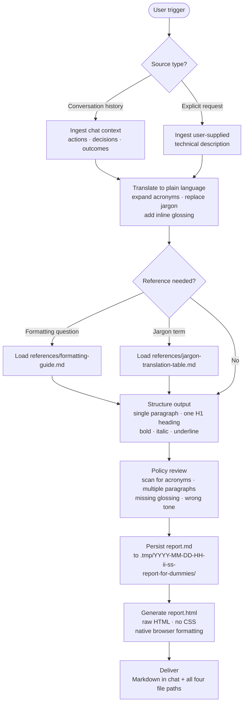

# report-for-dummies
Transforms technical conversation context or raw task details into a single, readable paragraph of plain-language notes formatted for an Asana task description. The output is deliberately simple: no abbreviations, no technical jargon, and every complex concept immediately followed by a plain-English explanation in parentheses.

The result is a professional, self-contained block of Markdown that a non-technical stakeholder can read in under thirty seconds — plus a matching minimal HTML rendering, both persisted to a timestamped folder under `.tmp/`.

## Install

The fastest cross-agent install path is the `skills` CLI:

```bash
npx skills add gg-skills/report-for-dummies
```

Drop this skill into a workspace as a Git submodule for pinned versions, or as a plain clone for latest `main`:

```bash
# Project-local, version-pinned:
git submodule add git@github.com:gg-skills/report-for-dummies.git .claude/skills/report-for-dummies

# OR project-local, latest main:
mkdir -p .claude/skills
git -C .claude/skills clone git@github.com:gg-skills/report-for-dummies.git

# OR user-level, available in every project on this machine:
mkdir -p ~/.claude/skills
git -C ~/.claude/skills clone git@github.com:gg-skills/report-for-dummies.git
```

Restart your agent or reload skills after installation. See the parent [`skills` catalog repo](https://github.com/gg-skills/skills) for the full catalog.

## When to use

- The user asks for a summary suitable for Asana, a task tracker, or a project management tool
- The user asks to "dumb down," "simplify," or "translate for stakeholders" any technical explanation
- The conversation contains implementation details, code changes, or architectural decisions that must be communicated to a non-technical audience
- The user explicitly mentions "report for dummies" or a similar plain-language summary intent

Skip when the audience is technical and expects precise terminology, when the output is meant for a runbook or code review, or when the user wants a full formal report with sections like Executive Summary, Methodology, or Appendix.

## How it operates

### Inputs

| Input | Source | Notes |
|-------|--------|-------|
| Technical work context | The live conversation history | Code changes, architectural decisions, implementation details — whatever Claude has already discussed with the user |
| Explicit user request | The user's prompt | May substitute for or augment conversation context (e.g. "Give me an Asana summary for: we ran a MongoDB aggregation…") |
| Target audience | Implied by the trigger | Always non-technical stakeholders; the output is sized for an Asana task description field |

No files need to be supplied by the user. The agent reads its own `references/formatting-guide.md` and `references/jargon-translation-table.md` on demand to resolve formatting questions and look up approved plain-English replacements for common technical terms.

### Outputs

Two files are written to disk on every run — no output is delivered only in the chat window:

| File | Location | Format |
|------|----------|--------|
| `report.md` | `.tmp/YYYY-MM-DD-HH-ii-ss-report-for-dummies/report.md` | Plain Markdown, Asana-compatible |
| `report.html` | `.tmp/YYYY-MM-DD-HH-ii-ss-report-for-dummies/report.html` | Raw HTML, no CSS, native browser formatting only |

The timestamp in the folder name uses the current date and time at the moment of generation (example: `.tmp/2026-05-16-14-32-05-report-for-dummies/`). If the `.tmp/` directory does not exist at the workspace root it is created before writing.

After writing, the agent prints all four paths (absolute and relative for each file) directly in the chat.

### External commands

No shell scripts or CLI tools are invoked. The Markdown-to-HTML conversion is performed by the agent itself: it maps Markdown syntax to HTML tags (`#` → `<h1>`, `**text**` → `<strong>`, `*text*` → `<em>`, `- ` → `<ul><li>`, `<u>` preserved as-is) and wraps the result in a minimal HTML skeleton. No `pandoc`, `marked`, or other renderer is required.

### Side effects

- Creates `.tmp/` at the workspace root if it does not already exist.
- Writes `report.md` and `report.html` to a new timestamped subfolder inside `.tmp/`. Files from previous runs are never overwritten (each run gets its own folder).
- No network requests are made. No environment variables are read or set. No package installations occur.

### Mode toggles

The skill has two non-negotiable behavioral policies that govern every run:

**Zero-acronym policy.** Every initialism is expanded inline on first use, even universally known ones. "We fixed the API" must become "We fixed the programming interface that other systems use to talk to ours (this is called an application programming interface)." There is no flag to suppress this.

**Inline-glossing policy.** Every concept that assumes specialized knowledge is immediately followed by a short parenthetical explanation. The parenthetical is written as "this is called X" or "these are called X." Obvious everyday terms (email, website) are never glossed. The level of glossing is calibrated to a non-technical manager reading on mobile — if they would pause on the term, it gets a parenthetical.

## Operational flow



## Layout

```
.
├── SKILL.md          ← entry point with YAML frontmatter, policy, workflow, examples
├── agents/
│   └── openai.yaml   ← agent interface descriptor
├── assets/           ← supporting media referenced by the corpus
└── references/       ← topic docs the skill loads on demand
    ├── formatting-guide.md          ← complete Markdown formatting rules for Asana
    └── jargon-translation-table.md  ← common technical terms and plain-English replacements
```

## Quick start

Read [SKILL.md](SKILL.md) — it contains the trigger list, the non-negotiable policy (one paragraph, zero acronyms, inline glossing of every complex concept, strict Markdown structure), and the full six-step workflow from ingestion through dual-format persistence (`report.md` + `report.html`) under `.tmp/YYYY-MM-DD-HH-ii-ss-report-for-dummies/`.

There are no helper scripts in this skill — all work is performed by the agent reading SKILL.md directly. The two reference files exist for deeper lookups on formatting rules and jargon translation.

## Resources

- [SKILL.md](SKILL.md) — main entry point with policy, workflow, worked examples
- [agents/openai.yaml](agents/openai.yaml) — agent interface descriptor
- [references/](references/) — formatting guide and jargon translation table
- [assets/](assets/) — supporting media

## Caveats

- **Output is always one paragraph.** Never break the summary into multiple paragraphs or sections.
- **Zero-acronym policy.** Expand every initialism, even common ones like "API" or "URL." If an abbreviation is unavoidable in a proper noun, spell it out on first use.
- **Inline glossing is mandatory.** Every complex concept is immediately followed by a short parenthetical explanation; do not omit and do not over-explain obvious terms.
- **Dual persistence is required.** After finalising the Markdown, write `report.md` and a stylesheet-free `report.html` to `.tmp/YYYY-MM-DD-HH-ii-ss-report-for-dummies/`, then report both absolute and relative paths for each file.
- **HTML must be unstyled.** Use only raw HTML tags — no CSS, no `<style>`, no `class` or inline `style` attributes. Native browser formatting only.
- **Underline support is fragile in Asana.** The skill mandates `<u>` for first mentions of names, systems, or tools, but Asana renders it inconsistently — fall back to bold if needed when pasting.
- **Never invent facts.** Only summarise what is present in the conversation context or the user's explicit request.
